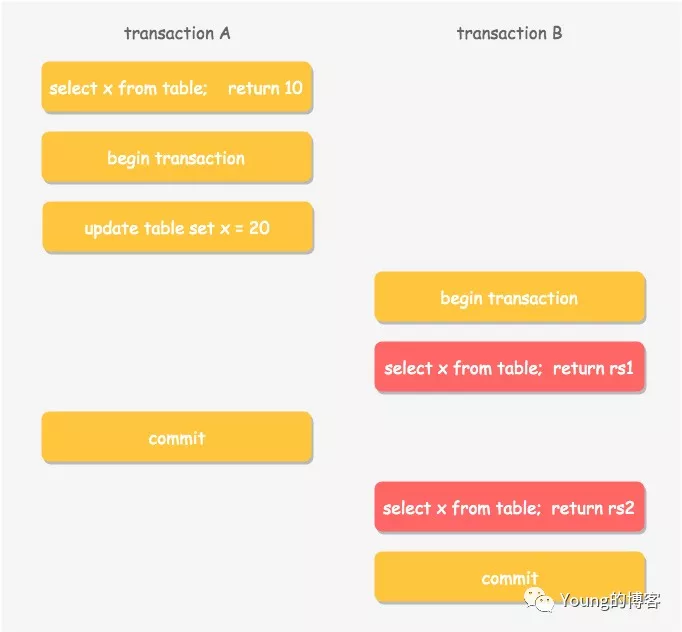

# mysql基础知识

## 1. mysql主键

主键:primary key,表中主要的键，每张表中只能有一个字段使用此属性

主要作用：用来唯一的约束该字段里面的数据，不能重复

主键约束：即主键对应的字段里面的数据不允许重复，如果重复，则数据操作（增改）失败

主键分类：根据主键的字段类型，咱们可以将主键分为两类：

- 业务主键，使用真实的业务数据作为主键，例如学号、课程编号等等
- 逻辑主键，使用逻辑性的字段作为主键，字段没有业务含义，值有没有都没有关系，经常使用

## 2. mysql唯一键

唯一键：每张表中往往有多个字段需要具有唯一性，数据不能重复，但是在每张表中，只能有一个主键，因此唯一键用来解决表中多个字段需要具备唯一性的问题，唯一键的本质与主键差不多，唯一键默认允许字段为空，而且可以多个字段为空，因此，空字段不参与唯一性的比较。当唯一键满足非空条件的时候，其性质跟主键是一样的。

唯一键与主键的区别：唯一键允许字段值为空，并且允许多个空值存在

## 3. 索引

索引：系统根据某种算法，将已有的数据(未来可能新增的数据),单独建立一个文件，这个文件能够实现快速匹配数据，并且能够快速的找到对应的记录，几乎所有的索引都是建立在字段之上的。

索引的意义：

- 提升查询数据的效率
- 约束数据的有效性

增加索引的条件：

- 如果某个字段需要作为查询的条件经常使用，可以使用索引
- 如果某个字段需要进行数据的有效性约束，也可以使用索引(主键和唯一键)

索引的分类：

- 主键索引 (primary key)
- 唯一键索引 (unique key)
- 普通索引 (index)
- 全文索引 (fulltext index)

> 全文索引即根据文章内部的关键词进行索引，其最大的难度在于如何确定关键词

## 4. 范式

范式：Normal farmat ,是为了解决数据的存储和优化问题

在数据存储之后，范式能够通过关系寻找出来的数据，坚决不再重复存储，范式的终极目标是减少数据冗余

范式是一种分层结构的规范，共6层，分别为1NF、2NF、3NF、4NF、5NF、6NF，每一层都比上一层严格，若要满足下一层范式，其前提是先满足上一层范式。其中1NF是最底层的范式。6NF是最高层的范式，也最严格

MySQL数据属于关系型数据库，其存储数据的时候有些浪费空间，但也致力于节省空间，这就与范式想要解决的问题不谋而合，因此在设计数据库的时候，大都会利用范式来知道设计。但是数据库不单是要解决存储空间的问题，还要保证效率的问题，而范式只为解决存储空间的问题，所以数据库的设计又不能完全按照范式的要求来实现，因此在一般情况下，只需要满足前三种范式即可

1. 1NF

第一范式：在设计表存储数据的时候，如果表中设计的字段存储的数据，在取出来使用之前还需要额外的处理(拆分)，那么表的设计就不满足第一范式，第一范式要求字段的数据具有原子性，不再可分

例如：

id | 学校名称 | 起始时间，结束时间
-|-|-
1 | 哈尔滨工业大学 | 20170625,20170903
2 | 浙江大学 | 20170630,20170901

观察上表，咱们会发现表1的设计并没有什么问题，但是如果需求是查询各学校开始放假的日期呢？那显然上表的设计不满足1NF,数据不具有原子性。

拆分后的表

id | 学校名称 | 起始时间 | 结束时间
-|-|-|-
1 | 哈尔滨工业大学 | 20170625 | 20170903
2 | 浙江大学 | 20170630 | 20170901

2. 2NF

第二范式：在数据表的设计过程中，如果有复合主键(多字段主键),切表中有字段并不是由整个主键来确定，而是依赖复合主键中的某个字段(主键的部分),也就是说存在字段依赖主键的部分的问题(称之为部分依赖),第二范式就是解决表设计中不允许出现部分依赖

例如，设计一个教室授课表

教师 | 性别 | 课程 | 授课地点
-|-|-|-
许仙 | 男 | <<如何追到心爱的女生>> | 杭州西湖
白娘子 | 女 | <<论女人的恋爱修养>> | 雷峰塔
白娘子 | 女 | <<如何打赢持久战>> | 金山寺

观察上表，教师不能作为独立的主键，需要与授课的地点相结合才能作为主键(复合主键，每个教师的某个课程只能在固定的地点上)，其中性别依赖于具体的老师，而课程依赖于授课地点，这就出现了表的字段依赖于部分的主键的问题，从而导致不满足第二范式

解决方案1：将教师和性别，课程和授课地点，分成两张表
解决方案2：取消复合主键，使用逻辑主键

在此，我们采用方案2

id | 教师 | 性别 | 课程 | 授课地点
-|-|-|-|-
1 | 许仙 | 男 | <<如何追到心爱的女生>> | 杭州西湖
2 | 白娘子 | 女 | <<论女人的恋爱修养>> | 雷峰塔
3 | 白娘子 | 女 | <<如何打赢持久战>> | 金山寺

3. 3NF
第三范式：需要满足第一范式和第二范式，理论上讲，每张表中的所有字段都应该直接依赖主键(逻辑主键，代表是业务主键)，如何表设计中存在一个字段，并不直接依赖主键，而是通过某个非主键字段依赖，最终实现主键依赖(把这种不是直接依赖主键，而是依赖非主键字段的依赖关系，称之为传递依赖)，第三范式主要解决的是表设计中出现的传递依赖的问题

id | 教师 | 性别 | 课程 | 授课地点
-|-|-|-|-
1 | 许仙 | 男 | <<如何追到心爱的女生>> | 杭州西湖
2 | 白娘子 | 女 | <<论女人的恋爱修养>> | 雷峰塔
3 | 白娘子 | 女 | <<如何打赢持久战>> | 金山寺

在以上表的设计中，性别依赖于教师，教师依赖于主键，课程依赖授课地点，授课地点依赖主键，因此性别和课程都存在传递依赖得问题

解决方案：将存在传递依赖的字段以及依赖的字段本身单独取出来，形成一个单独的表，然后在需要使用对应信息的时候，把对应的实体表的主键添加进来

id | 教师 | 性别 |
-|-|-
1 | 许仙 | 男 |
2 | 白娘子 | 女 |
3 | 白娘子 | 女 |

address_id | 课程 | 授课地点
-|-|-
1 | 许仙 | <<如何追到心爱的女孩>> | 杭州西湖 
2 | 白娘子 | <<论女人的恋爱修养>> | 雷峰塔
3 | 白娘子 | <<如何打赢持久战>> | 金山寺

id | Teacher_id | Address_id |
-|-|-
1 | 1 | 1 |
2 | 2 | 2 |
3 | 3 | 3 |

总结：

1NF：字段不可分
2NF:有主键，非主键字段依赖主键
3NF:非主键字段不能相互依赖

解释：
1NF：原子性，字段不可再分，否则就不是关系型数据库
2NF：唯一性，一个表只说明一个事物，表中的每一列的字段你都和主键相关
3NF:每列都与主键有直接关系，不存在依赖传递，更进一步

## 5.连接查询

连接查询：将多张表(大于等于2张表)按照某个指定的条件进行数据的拼接，其最终结果记录数可能有变化，但字段数一定会增加

连接查询的意义：在用户查询数据的时候，需要显示的数据来自于多张表

1. 内连接
2. 外连接
3. 自然连接
4. 交叉连接

### 交叉连接
交叉连接：cross join，从一张表中循环取出每一条记录，每条记录都去另外一张表进行匹配，匹配的结果都保留，而连接本身的字段会增加，最终形成的结果为笛卡尔积形式

其结果与多表查询相同

    select * from student cross join class;
    select * from student,class;

实际上，这种查询方式没有意义感觉,其实就是查询两种表的数据，比如第一张表的个数是m,第二张表的个数是n,那么查询的结果就是m*n条数据

### 内连接

内连接:inner join ，从坐标中取出每一条记录，和右表中的所有记录进行匹配，并且仅当某个条件在左表则不保留。和右表中的值相同的时候，结果才保留。

基本语法: 左表 + inner join + 右表 + on + 左表.字段 = 右表.字段

    select * from student inner join class on student.grade = class.grade;
    select * from student join class on student.grade = class.grade;

最后，内连接可以没有连接条件，即可以没有on后面的内容，这时候内连接的结果全部保留，与交叉连接结果相同。而且在内连接的时候可以用where关键字替代on ,但where没有on的效率高

### 外连接

外连接:left/right join 以某张表为主表，取出里面的所有记录，然后让主表中的每条记录都与另外一张表进行连接，不管是否匹配成功，其最终的结果都会保留，匹配成功，则正确保留，匹配失败，则将另一张表的字段都设置为NULL

基本语法：左表 + left/right join + 右表 + on + 左表.字段 = 右表.字段

left join:左外连接，以左表为主表
right join:右外连接，以右表为主表

### 自然连接

自然连接：nature join ，自然连接其实就是自动匹配连接条件，系统以两表中同名字段作为匹配的条件，如果两表有多个同名字段，那就都作为匹配条件，自然连接分为自然外连接和自然内连接

自然内连接基本语法：左表 + nature join + 右表
自然外连接基本语法：左表 + nature left/right join + 右表

## 6.外键

外键：foregin key，外面的键，即不在自己表中的键。如果一张表中有一个非主键的字段指向另外一张表的主键，那么该字段就称之为外键，每张表中，可以有多个外键

外键的默认作用有两个：分别对子表和父表进行约束

1. 约束子表,在子表(有外键的表)进行数据写操作的时候(增和改),如果对应的外键字段在父表(外键指向的表)找不到对应的匹配，那么操作失败

2. 约束父表：在父表进行数据的写操作(删和改)的时候，如果对应的主键字段在字表中已经被数据引用了，则操作失败

举例一个订单的表，里面放着某个产品的订单信息，当你修改或者删除该订单的时候，如果该订单的产品不在产品的表中，会出现错误。反之，当你把产品的信息删除或者修改了，同样也会影响订单的表，所以这时候就需要进行外键的约束了

## 7. 联合查询

联合查询：union，将多次查询的结果，在字段数量相同的情况下，在记录的层次上进行拼接

基本语法：select 语句1 + union + 选项 + select 语句2 + ....

union选项:
- all，无论重复与否，保留所有的选项
- distinct:表示去重，为默认选项

举例:

    //联合查询，默认去重    
    select * from class union distinct select * from class;
    //联合查询，保留所有的记录
    select * from class union all selct * from class;

联合查询的意义：

- 查询同一张表，按时需要不同，例如查询学生信息，要求男生按年龄升序排序，女生按年龄降序排序

- 多表查询，多张表的结构是完全一样的，保持的数据结构有是一样的。此外，如果数据量非常的大，就要进行分表(垂直分表和水平分表)

> 注意，联合查询的时候注意加()和加limit

## 7. 子查询

子查询：sub query,查询是在某个查询结果之上进行的，一条select语句内部包含了另外一条select语句

子查询分为两种类型：

- 按结果分类
    - 标量子查询:子查询得到的结果是一行一列，出现的位置在where之后
    - 列子查询：子查询得到的结果是一列多行，出现的位置在where之后
        - in/not in 等于列表中的任意一个,解释a=in(10,20,30)只要等于里面的任意一个即可
        - any/some 和子查询返回的某一个值进行比较,解释a>any(10,20,30)只要比最小的大就行
        - all 和子查询返回的所有值进行比较 ,解释a>all(10,20,30)大于里面所有的值
    - 行子查询:子查询得到的结果是多行一列(多行多列),出现的位置在where之后
    - 表子查询：子查询得到的结果是多行多列,出现的位置在from之后
- 按位置分类
    
    -select子查询:子查询出现在select之后
        - 仅支持标量子查询
    - from子查询:子查询出现在from之后
    - where子查询：子查询出现在where条件之中
        - 这个一般会有三种情况：一种是一行一列(标量子查询)、一列多行(列子查询)、多行多列(行子查询)
    - exists子查询：子查询出现在exists里面

## 8. 视图

视图：view,是一种有结构(有行有列),但没有结果(结构中不真实存放数据)的虚拟表。虚拟表的结构原来不是自己定义的，而是从对应的基表(视图的数据来源)中产生的

基本语法：create view + 视图名 + as + select语句

其中，select语句可以是普通查询，也可以是连接查询、联合查询、子查询等

此外，视图根据数据的来源，可以分为单表视图和多表视图

视图的主要作用：视图可以节省sql语句，将一条复杂的查询语句用视图来进行封装，以后可以直接对视图进行操作

数据安全，视图操作主要针对查询的，如果对视图结构进行处理，并不会影响基表的数据

视图往往会用在大型项目中，而且是多系统中，可以对外提供有用的数据，但是隐藏关键的数据

## 9. 事务

案例：银行的数据库里面存储着用户的账户信息表，当用户 A 想用户 B 转账的时候，正常情况下，A 账户的余额减少，B 账户的余额增加；但是由于某种原因（例如突然断电），当 A 账户的余额减少之后，B 账户的余额并没有增加，这就造成了数据库数据的安全隐患。

解决方案：当 A 账户的余额减少之后，不要立即修改数据表，而是在确认 B 账户的余额增加之后，同时修改数据表。

通过前面的案例及解决方案，我们就引出了一个全新的概念，那就是：事务，即
一系列将要发生或正在发生的连续操作。

而事务安全，是一种保护连续操作同时实现（完成）的机制。事务安全的意义就是，保证数据操作的完整性。

1. 第一步，开启事务,start transaction
2. 第二步,减少A账户的余额
3. 第三步,增加B账户的余额
4. 第四步,提交事务或回滚事务,提交commit 回滚rollback,如果我们选择提交事务，则将事务日志存储的记录直接更新到数据库，并清除事务日志。如果我们选择回滚事务，则直接将事务日志清除，所有在开启事务至回滚事务之间的操作失效，保持原有的数据库记录不变

事务的原理：在事务开之后，所有的操作都会被临时存储到事务的日志，事务日志只有在收到commit命令之后，才会将操作同步到数据表，其他任何情况下都会清空事务日志，例如突然断开了连接、收到了rollback命令了

我们来分析一下MySQL的操作过程：

1. 客户端与服务器端建立连接，同时开启一个临时的事务日志，此事务日志当前用户的当次连接
2. 在客户端用sql语句执行写操作，客户端收到sql语句，执行，将结果直接写入数据表，并将数据表同步到数据库
3. 我们在客户端开启事务，则服务器端原来的操作机制被改变，后续所有的操作都会被先写到临时的日志文件
4. 在客户端执行sql语句的时候，服务器接收到sql语句，执行，将结果写入到临时的日志文件，并不将结果同步到数据库
5. 在客户端执行查询操作，服务端直接从临时日志文件中捞取数据，返回给客户端
6. 在客户端执行commit或者rollback命令，清空临时日志文件，如果是commit命令，则将结果同步到数据库，如果是rollback命令，则不同步

通过上面的分析，我们就知道了为什么在我们同时开启两个 MySQL 客户端窗口（两次连接）时，当一个窗口开启事务并执行 SQL 操作之后，另一个窗口在查询时并不会收到同步数据。原因就在于，当我们开启事务之后，服务端会将后续的操作都写入到临时日志文件，而另一个窗口在查询的时候，则是直接从数据库捞取数据，并会不走前一个的临时日志文件。

事务的特性，可以简单的概括为ACID，具体为：

- 原子性：Atomic，表示事务的整个操作是一个整体，是不可分割的，要么全部成功，要么全部失败；
- 一致性：Consistency，表示事务操作的前后，数据表中的数据处于一致状态；
- 隔离性：Isolation，表示不同的事务操作之间是相互隔离的，互不影响；
- 持久性：Durability，表示事务一旦提交，将不可修改，永久性的改变数据表中的数据。

## 10. 触发器

网上购物，根据生产订单的类型，商品的库存量对应的进行增和减。此案例涉及到两张表，分别为订单表和商品表。下单时候，商品表的库存减少，退单时候，商品表库存增加，如何实现？

触发器:trigger,是指事先为某张表绑定一段代码，当表中的某些内容发生改变(增、删、该)的时候，系统会自动触发代码执行

触发器包含三个要素:
事件类型:增删改，即insert/delete/update
触发时间：事件类型前和后，即before和after
触发对象：表中的每一条记录，即整张表

每张表只能拥有一种触发时间的一种事件类型的触发器，即每张表最多可以拥有6种触发器

delimiter 自定义符号 -- 临时修改语句结束符，在后续语句中只有遇到自定义符号才会结束语句

create trigger + 触发器名称 + 触发器时间 + 事件类型 on 表名 for each row

begin -- 代表触发器内容开始

-- 触发器内容主体，每行用分号结尾

end -- 代表触发器内容结束

自定义符号 -- 用于结束语句

delimiter ; -- 恢复语句结束符

## 11. 存储过程

存储过程简称过程,procedure,是一种用来处理数据(增删改)的方式。简单点，我们可以理解为没有返回值的函数

create procedure 过程名([参数列表])

begin 

    ---过程体
end    

# mysql对千万级别的大表如何优化

很多人第一反应是各种切分；我给的顺序是:

第一在表、字段设计阶段，考虑更优的存储和运算

第二在数据库本身提供的优化手段上---索引

第三加缓存，这里你可使用应用层的缓存memcached,redis，也可以使用SQL中的自带的缓存功能

第三以上都做了后，还是慢，就做主从复制或主主复制，读写分离，可以在应用层做，效率高，也可以用三方工具

第四如果以上都做了还是慢，mysql自带分区表，先试试这个，对你的应用是透明的，无需更改代码,但是sql语句是需要针对分区表做优化的，sql条件中要带上分区条件的列，从而使查询定位到少量的分区上，否则就会扫描全部分区

第五如果以上都做了，那就先做垂直拆分，其实就是根据你模块的耦合度，将一个大的系统分为多个小的系统，也就是分布式系统

第六才是水平切分，针对数据量大的表，这一步最麻烦，最能考验技术水平，要选择一个合理的sharding key,为了有好的查询效率，表结构也要改动，做一定的冗余，应用也要改，sql中尽量带sharding key，将数据定位到限定的表上去查，而不是扫描全部的表

mysql数据库一般都是按照这个步骤去演化的，成本也是由低到高

最后，我们还可以优化自己的sql语句，通过profile和慢查询日志找到慢的点针对性的优化，同时也可以通过mysqlslap进行压力测试

# MySQL常见面试题

## 1. 什么是事务？事务的特性是什么？分别解释一下

事务是指作为单个逻辑工作单元执行的一系列操作，可以被看做一个单元的一系列sql语句的集合，要么完全执行，要么完全不执行

如果不对数据库进行并发控制，可能会产生脏读、非重复读、幻像读、丢失修改的异常情况

事务的特性ACID分别解释如下：

1. 原子性

原子性是指事务是一个不可分割的工作单位，事务中的操作要么全部成功，要么全部失败。比如在同一事务中的sql语句，要么全部执行成功，要么全部执行失败

2. 一致性

事务必须使数据库从一个一致性状态变换到另外一个一致性状态。以转账为例，A向B转账，假设转账之前这两个用户的钱加起来总共是2000，那么A向B转账之后，不管这两个账号怎么转，A用户的钱和B用户的钱加起来的总额还是2000，这个就是事务的一致性

3. 隔离性

隔离性是当多个用户并发访问数据库时，比如操作同一张表时，数据库为每一个用户开启的事务，不能被其他事务的操作干扰，多个并发事务之间要相互隔离

即要达到这么一种效果：对于任意两个并发的事务t1和t2,在事务t1看来，t2要么在t1开始之前就已经结束，要么在t1结束之后才开始，这么每个事务都感觉不到有其他的事务在并发的执行

4. 持久性

一旦事务提交，则其所作的修改将会永远保存到数据库中。即使系统发生崩溃，事务执行的结果也不能丢失。

举例说明：

A向B汇钱100

1. 读出A账号余额(500)
2. A账号扣钱操作(500-100)
3. 结果写回A账号(400)
4. 读出B账号余额(500)
5. B账号做加法操作(500+100)
6. 结果写回B账号(600)

原子性：保证1-6所有过程要么都执行，要么都不执行
一致性：转账前，A和B的账户共有500+500=1000,转账后，A和B的账户共有400+600=1000元
隔离性：在A向B转账的整个过程中，只要事务还没有提交，查询A账号和B账号的时候，两个账号的钱的数量都不会有变化
持久性：一旦转账成功(事务提交),两个账户的里面的前就真的发生变化

## 2. 什么是脏读？幻读？不可重复读？什么是事务的隔离级别？mysql中默认的隔离级别是？

T1和t2两个事务都对一个数据进行修改，t1先修改，t2随后修改，t2的修改覆盖了t1的修改

### 脏读

(针对未提交数据)如果一个事务中对数据进行了更新，但事务还没有提交，另一个事务可以看到该事务没有提交的更新结果，这样造成的问题是，如果第一个事务回滚，那么第二个事务在此之前看到的数据就是一笔脏数据(脏读也称无效数据读出。一个事务读取另外一个事务还没有提交的数据叫脏读)

***例子：***

mary的原工资为1000，财务人员将mary的工资改为了8000(但未提交事务)

mary读取自己的工资，发现自己的工资变为了8000，欢天喜地！

而财务发现操作有误，回滚了事务，mary的工资变为了1000

像这样，mary记取的工资数8000是一个脏数据

解决方案：将数据库的事务隔离级别调整到READ_COMMITTED

***图解：***

t1修改了一个数据，t2随后读取这个数据，如果t1撤销了这次修改，那么t2读取的就是脏数据

### 不可重复读

是指在一个事务内，多次读同一个数据。在这个事务还没有结束时候，另外一个事务也访问该同一数据。那么，在第一个事务中的两次读取数据之间，由于第二个事务的修改，那么第一个事务两次读到的数据可能是不一样的。这样，在一个事务内两次读到的数据是不一样的，因此 称为不可重复读。(同时操作，事务1分别读取事务2操作时和提交后的数据，读取的记录内容不一致。不可重复读是指在同一个事务中，两个相同的查询返回了不同的结果)

例子：

1. 在事务1中,mary读取了自己的工资为1000,操作并没有完成

    con1 = getConnection();
    select salary from employee empId = "mary";

2. 在事务2中，这时财务人员修改了mary的工资为2000,并提交了事务

    con2 = getConnection();
    update employee set salary = 2000;
    con2.commit()

3. 在事务1中，mary再次读取自己的工资的时候，工资变为了2000

解决办法：如果只有在修改事务完全提交之后才能读取数据，则可以避免该问题。把数据库的事务隔离级别调整到repeatble_read

图解：

### 幻读

事务t1读取一条指定的where子句所返回的结果集，然后t2事务新插入一行记录，这行记录恰好满足t1所使用的查询条件。然后t1再次对表进程检索，但又看到了t2插入的数据.(和可重复读类似，但是事务2的数据操作仅仅是插入和删除，不是修改数据，读取的记录数量前后不一致)

幻读的重点在于新增或者删除(数据条数变化)

例子：

1. 目前工资1000的员工有10个，事务1，读取所有工资为1000的员工(共读取10条记录)

    con1 = getConnection();
    select * from employee where salary = 1000;

2. 这时候，另一个事务向employee表插入了一条员工记录，工资也为1000

    con2 = getConnection();
    Insert into employee(empId,salary) values("LiLi",1000);
    con2.commit();

3. 事务1再次读取所有工资为1000的员工(共读取了11条记录，产生了幻读

    //con1
    select * from employee where salary=1000;

解决办法：如果在操作事务完成数据处理之前，任何其他事务都不可以添加新的数据，则可避免该问题，把数据库的事务隔离级别调整为serializable_read

图解：

### 事务的隔离级别 --- 你可以理解为这是事务中的的锁

1. 串行化(serializeble)  一般不需要手动加锁

最高级别的事务隔离级别，所有的事务一个接一个执行，可以避免幻读

2. 可重复读(repeatable read) 一般需要配合读写锁一起解决幻读问题，这是mysql的默认隔离级别

重复读，就是在开始读取数据(事务开启)时，不再允许修改操作

重复读可以解决不可重复读问题，不可重复读对应的是修改，即update操作，但又可能出现幻读问题。因为幻读对应的是insert操作

3. 读已提交(read committed) 需要手动加锁

读提交，顾名思义，就是一个事务要等待另外一个事务提交之后才能读取数据

若有事务对数据进行更新操作时，读操作事务要等待这个更新操作事务提交之后才能读取数据，可以解决脏读的问题

4. 读未提交(read uncommitted)  需要手动加锁

顾名思义，一个事务可以读取另外一个事务未提交的数据

> 一般情况下我们要弄明白一个问题:为什么需要锁？多线程的时候，我们如果不加锁的话，那么不同的线程争夺cpu的控制权必然会对相同的数据进行不同的操作，比如线程1改写成0，线程2改写成1，那么最终的结果可能是000011111111... 所以，当线程1在修改数据的时候我们必然要对数据加锁,这个很容易理解。那么在数据库里面的加锁是一种什么情况呢？详细的请看下面的锁的分析

## 3.mysql中有哪些锁？分别介绍下 --- 你可以理解为现在讨论的是非事务中的锁,这种锁是要在事务隔离级别之上继续加锁

### 乐观锁 --- 从使用方式上

用数据库版本(version)记录机制实现，这是乐观锁最常用的一种实现方式。何为数据版本？即为数据增加一个版本标识，一般是通过为数据库表增加一个数字类型的version字段来实现。当读取数据的时候，将version字段的值一同读出，数据每更新一次，对此version值加1.当我们提交更新的时候，判断数据库表对应记录的当前版本信息与第一次取出的version值进行比对，如果数据库表当前版本与第一次取出的version值相等，则予以更新，否则认为是过期数据

举例：

数据库表设计，三个字段，分别是id,value,version

    select id,vlaue,version form TABLE where id=#{id}

每次更新表中value值字段的时候，为了防止冲突，需要进行下面的操作

    update TABLE set value=2,version=version+1 where id=#{id} and version=#{version}

### 悲观锁 --- 从使用方式上

与乐观锁相对应的就是悲观锁了。悲观锁是在操作数据的时候，认为此操作会出现数据冲突，所以在进行每次操作时候都要通过获取锁才能进行相同数据的操作

悲观锁涉及到共享锁和拍他锁。共享锁和排他锁是悲观锁的不同的实现

以排它锁为例：

要使用悲观锁，我们必须关闭MySQL数据库的自动提交属性，因为MySQL默认使用的是autocommit模式，也就是说，当你执行一个更新操作后，MySQL会立刻将结果进行提交

    set autocommit = 0;
    #设置完autocommit后，我们就可以执行我们正常的业务了
    #1. 开始事务
    begin;/begin work;/start transaction;
    #2. 查询表信息
    select status from TABLE where id=1 for update;
    #3. 插入一条数据
    insert into TABLE (id,value) vlaues(2,2);
    #4. 修改数据为
    update TABLE set value=2 where id=1;
    #5. 提交事务
    commit/commit work;

### 共享锁----从数据的操作类型上看就是读锁

共享锁又称读锁(read lock),是读取操作创建的锁。其他的用户可以并发的读取数据，但任何事务都不能对数据进行修改(获取数据上的排他锁)，直到已释放所有共享锁

如果事务T对数据A加上共享锁以后，则其他的事务只能对再加共享锁，不能加排他锁。获得共享锁的事务只能读数据，不能修改数据

打开第一个查询窗口

    begin;/begin work;/start transaction;
    select * from TABLE where id=1 lock in share mode;

然后在另一个查询窗口中对ID为1的数据进行更新

    update TABLE set name="www.baidu.com" where id=1;

此时，操作界面处于卡顿状态，过了超时间，提示错误信息

如果在超时前，执行了commit ，此更新语句会成功

    [SQL]update  test_one set name="www.souyunku.com" where id =1;
    [Err] 1205 - Lock wait timeout exceeded; try restarting transaction

加上共享锁后，也提示错误信息

    update test_one set name="www.souyunku.com" where id =1 lock in share mode;
    [SQL]update  test_one set name="www.souyunku.com" where id =1 lock in share mode;
    [Err] 1064 - You have an error in your SQL syntax; check the manual that corresponds to your MySQL server version for the right syntax to use near 'lock in share mode' at line 1

在查询语句后面增加lock in share mode,mysql会对查询结果中的每行都加上共享锁，当没有其他的线程对查询结果集中的任何一行使用排他锁时候，可以成功申请共享锁，否则会阻塞。其他线程也可以读取使用了共享锁的表

加上共享锁之后，对于update/insert/delete语句会自动加上排它锁

### 排他锁 --- 从数据的操作类型上看的话就是写锁

排它锁也称写锁

若事务 1 对数据对象 A 加上 X 锁，事务 1 可以读 A 也可以修改 A，其他事务不能再对 A 加任何锁，直到事物 1 释放 A 上的锁。这保证了其他事务在事物 1 释放 A 上的锁之前不能再读取和修改 A。排它锁会阻塞所有的排它锁和共享锁

读取为什么要加读锁呢：防止数据在被读取的时候被别的线程加上写锁

使用方式：在需要执行的语句后面加上 for update 就可以了

### 行锁 --- 从对数据操作的粒度上分的话就是锁定一行

行锁又分为共享锁和拍他锁，字面理解的话，就是给某一行加上锁，也就是一条记录加锁

    #结果集的数据都会加共享锁
    SELECT * from TABLE where id = "1"  lock in share mode;

    #加上排它锁
    select status from TABLE where id=1 for update;

### 表锁 --- 从对数据的操作粒度上来分的话就是锁定整个表

如何加表锁

innodb 的行锁是在有索引的情况下,没有索引的表是锁定全表的.

Innodb中的行锁与表锁

前面提到过，在 Innodb 引擎中既支持行锁也支持表锁，那么什么时候会锁住整张表，什么时候或只锁住一行呢？ 只有通过索引条件检索数据，InnoDB 才使用行级锁，否则，InnoDB 将使用表锁！

在实际应用中，要特别注意 InnoDB 行锁的这一特性，不然的话，可能导致大量的锁冲突，从而影响并发性能。

行级锁都是基于索引的，如果一条 SQL 语句用不到索引是不会使用行级锁的，会使用表级锁。行级锁的缺点是：由于需要请求大量的锁资源，所以速度慢，内存消耗大。

## 4.什么是死锁？怎么解决？

所谓的死锁：是指两个或两个以上的进程在执行过程中，因争夺资源而造成的一种互相等待的现象，若无外力作用，他们都将无法推进下去。此时称系统处于死锁状态或系统产生了死锁，这些永远在互相等待的进程称为死锁进程。由于资源占用是互斥的，当某个进程提出申请资源后，使得有关进程在无外力协助下，永远分配不到必须的资源而无法进行

解除正在死锁的状态有两种方式：

第一种：1. 查询是否锁表

    show OPEN TABLES where In_use > 0

查询进程(如果有super权限，你可以看到所有线程，否则，只能看到自己的)
    show processlist

杀死进程id

    kill id 

第二种：1.查看当前的事务

    select * from INFORMATION_SCHEMA.INNODB_TRX;

查看当前锁定的事务

    SELECT * FROM INFORMATION_SCHEMA.INNODB_LOCKS;

查看当前等锁的事务

    SELECT * FROM INFORMATION_SCHEMA.INNODB_LOCK_WAITS;

杀死进程

    kill 进程ID    

## 5.大数据情况下如何做分页？

先快速定位需要获取的ID段、然后再关联

    select a.* from 表1 a,(select id from 表1 where 条件 limit 100000,20) b where a.id = b.id

## 6.myisam和innoDB的区别？至少5点

### myISAM

MySQL 5.5 版本之前的默认存储引擎，在 5.0 以前最大表存储空间最大 4G，5.0 以后最大 256TB。

Myisam 存储引擎由 .myd（数据）和 .myi（索引文件）组成，.frm文件存储表结构（所以存储引擎都有）

特性

- 并发性和锁级别 （对于读写混合的操作不好，为表级锁，写入和读互斥）
- 表损坏修复
- Myisam 表支持的索引类型（全文索引）
- Myisam 支持表压缩（压缩后，此表为只读，不可以写入。使用 myisampack 压缩）

应用场景

- 没有事务
- 只读类应用（插入不频繁，查询非常频繁）
- 空间类应用（唯一支持空间函数的引擎）
- 做很多 count 的计算

### InnoDB

MySQL 5.5 及之后版本的默认存储引擎

特性

- InnoDB为事务性存储引擎
- 完全支持事物的 ACID 特性
- Redo log （实现事务的持久性） 和 Undo log（为了实现事务的原子性，存储未完成事务log，用于回滚）
- InnoDB支持行级锁
- 行级锁可以最大程度的支持并发
- 行级锁是由存储引擎层实现的

应用场景

- 可靠性要求比较高，或者要求事务
- 表更新和查询都相当的频繁，并且行锁定的机会比较大的情况。

区别总结：

- MyISAM 不支持外键，而 InnoDB 支持
- MyISAM 是非事务安全型的，而 InnoDB 是事务安全型的。
- MyISAM 锁的粒度是表级，而 InnoDB 支持行级锁定。
- MyISAM 支持全文类型索引，而 InnoDB 不支持全文索引。
- MyISAM 相对简单，所以在效率上要优于 InnoDB，小型应用可以考虑使用 MyISAM。
- MyISAM 表是保存成文件的形式，在跨平台的数据转移中使用 MyISAM 存储会省去不少的麻烦。
- InnoDB 表比 MyISAM 表更安全，可以在保证数据不会丢失的情况下，切换非事务表到事务表（alter table tablename type=innodb）。

## 7. 什么是数据库索引？索引有哪几种类型？什么是最左前缀原则？索引算法有哪些？有什么区别？

索引能够轻易的将查询性能提升几个数量级

1. 对于非常小的表、大部分情况下简单的全表扫描比建立索引更高效
2. 对于中到大型的表，索引就非常有效
3. 但是对于特大的表，建立和维护索引的代价将会随之增长。这种情况下，需要用到一种技术可以直接区分出需要查询的一组数据，而不是一条记录一条记录的匹配，例如可以使用分区技术

索引是在存储引擎层实现的，而不是在服务器层实现的，所以不同存储引擎具有不同的索引类型和实现

### B Tree原理

定义一条数据记录为一个二元组[key,data],B tree是满足下列条件的数据结构：

- 所有叶节点具有相同的深度，也就是说b-tree是平衡的
- 一个节点中的Key从左到右非递减排列
- 如果某个指针的左右相邻key分别是keyi和keyi+1,且不为null,则该指针指向节点的(所有key >= keyi)且(key <= keyi+1)

查找算法：首先在根节点进行二分查找啊，如果找到则返回对应节点的data,否则在相应区间的指针指向的节点递归进行查找

由于插入删除新的数据记录会破坏b-tree的性质，因此在插入删除时候，需要对树进行一个分裂、合并、旋转等操作

### B + Tree

与 B-Tree 相比，B+Tree 有以下不同点：

- 每个节点的指针上限为 2d 而不是 2d+1（d 为节点的出度）；
- 内节点不存储 data，只存储 key；
- 叶子节点不存储指针。

一般在数据库系统或文件系统中使用的 B+Tree 结构都在经典 B+Tree 基础上进行了优化，在叶子节点增加了顺序访问指针，做这个优化的目的是为了提高区间访问的性能

### 哪些情况下不会适用索引

- 如果MySQL估计使用全表扫秒比使用索引快，则不适用索引。

- 例如，如果列key均匀分布在1和100之间，下面的查询使用索引就不是很好：select * from table_name where key>1 and key<90;

- 如果条件中有or，即使其中有条件带索引也不会使用

- 例如：select * from table_name where key1='a' or key2='b';如果在key1上有索引而在key2上没有索引，则该查询也不会走索引

- 复合索引，如果索引列不是复合索引的第一部分，则不使用索引（即不符合最左前缀）

- 例如，复合索引为(key1,key2),则查询select * from table_name where key2='b';将不会使用索引

- 如果like是以 % 开始的，则该列上的索引不会被使用。

- 例如select * from table_name where key1 like '%a'；该查询即使key1上存在索引，也不会被使用如果列类型是字符串，那一定要在条件中使用引号引起来，否则不会使用索引

- 如果列为字符串，则where条件中必须将字符常量值加引号，否则即使该列上存在索引，也不会被使用。例如,select * from table_name where key1=1;如果key1列保存的是字符串，即使key1上有索引，也不会被使用。

- 如果使用MEMORY/HEAP表，并且where条件中不使用“=”进行索引列，那么不会用到索引，head表只有在“=”的条件下才会使用索引

### 哪些情况下适合建立索引

- 为经常出现在关键字order by、group by、distinct后面的字段，建立索引。
- 在union等集合操作的结果集字段上，建立索引。其建立索引的目的同上。
- 为经常用作查询选择 where 后的字段，建立索引。
- 在经常用作表连接 join 的属性上，建立索引。
- 考虑使用索引覆盖。对数据很少被更新的表，如果用户经常只查询其中的几个字段，可以考虑在这几个字段上建立索引，从而将表的扫描改变为索引的扫描。

## 8. 某个表有近千万数据，CRUD比较慢，如何优化？分库分表了是怎么做的？分表分库了有什么问题？有用到中间件么?他们的原理知道么

简单的说，数据的切分就是通过某种特定的条件，将我们存放在同一数据库中的数据分散存放在多个数据库中(主机)中，以达到分散单台设备负载的效果，即分库分表

数据的切分根据其切分规则的类型，可以分为如下两种切分模式

- 垂直切分：把单一的表拆分成多个表，并分散到不同的数据库上
- 水平切分：根据表中数据的逻辑关系，将同一个表中的数据按照某种条件拆分到多塔数据库中

### 垂直切分

也就是大表拆小表，基于列字段进行的。一般是表中的字段较多，将不常用的，数据较大，长度较长的拆分到扩展表中。一般是针对那种几百列的大表，也避免查询时，数据量太大造成的跨页问题

垂直分库针对的是一个系统中不同业务进行拆分，比如用户user一个库，商品product一个库，订单order一个库。切分后，放在多个服务器上，而不是一个服务器。为什么?我们想象一下，一个购物网站对外提供服务，会有用户、商品、订单等的CRUD。没有拆分之前，全部都是落到单一的库上的，这会让数据库的单库处理能力成为瓶颈。按垂直分库后，如果还是放在一个数据库服务器上，随着用户量的增大，这会然单个数据库的处理能力成为瓶颈，还有单个服务器的磁盘空间、内存非常吃紧

### 水平切分

针对数据量巨大的单张表（比如订单表），按照某种规则（RANGE,HASH取模等），切分到多张表里面去。 但是这些表还是在同一个库中，所以库级别的数据库操作还是有IO瓶颈。不建议采用

水平分库分表切分规则

- RANGE从

0到10000一个表，10001到20000一个表；

- HASH取模

一个商场系统，一般都是将用户，订单作为主表，然后将和它们相关的作为附表，这样不会造成跨库事务之类的问题。 取用户id，然后hash取模，分配到不同的数据库上。
地理区域
比如按照华东，华南，华北这样来区分业务，七牛云应该就是如此。

- 时间

按照时间切分，就是将6个月前，甚至一年前的数据切出去放到另外的一张表，因为随着时间流逝，这些表的数据 被查询的概率变小，所以没必要和“热数据”放在一起，这个也是“冷热数据分离”。

### 切分后面临的问题

- 事务支持

分库分表后，就成了分布式事务了。如果依赖数据库本身的分布式事务管理功能去执行事务，将付出高昂的性能代价； 如果由应用程序去协助控制，形成程序逻辑上的事务，又会造成编程方面的负担。

- 跨库join

只要是进行切分，跨节点Join的问题是不可避免的。但是良好的设计和切分却可以减少此类情况的发生。解决这一问题的普遍做法是分两次查询实现。在第一次查询的结果集中找出关联数据的id,根据这些id发起第二次请求得到关联数据。

- 分库分表方案产品

跨节点的count,order by,group by以及聚合函数问题

这些是一类问题，因为它们都需要基于全部数据集合进行计算。多数的代理都不会自动处理合并工作。解决方案：与解决跨节点join问题的类似，分别在各个节点上得到结果后在应用程序端进行合并。和join不同的是每个结点的查询可以并行执行，因此很多时候它的速度要比单一大表快很多。但如果结果集很大，对应用程序内存的消耗是一个问题。

数据迁移，容量规划，扩容等问题

来自淘宝综合业务平台团队，它利用对2的倍数取余具有向前兼容的特性（如对4取余得1的数对2取余也是1）来分配数据，避免了行级别的数据迁移，但是依然需要进行表级别的迁移，同时对扩容规模和分表数量都有限制。总得来说，这些方案都不是十分的理想，多多少少都存在一些缺点，这也从一个侧面反映出了Sharding扩容的难度。

ID问题

一旦数据库被切分到多个物理结点上，我们将不能再依赖数据库自身的主键生成机制。一方面，某个分区数据库自生成的ID无法保证在全局上是唯一的；另一方面，应用程序在插入数据之前需要先获得ID,以便进行SQL路由.
一些常见的主键生成策略

## 9. MySQL主从复制的实现原理是什么

基本原理流程，3个线程以及之间的关联；

- 主：binlog线程——记录下所有改变了数据库数据的语句，放进master上的binlog中；
- 从：io线程——在使用start slave 之后，负责从master上拉取 binlog 内容，放进 自己的relay log中；
- 从：sql执行线程——执行relay log中的语句；

## 10.如果解决秒杀的性能问题和超卖的讨论

抢订单环节一般会带来2个问题：

　　1、高并发

　　比较火热的秒杀在线人数都是10w起的，如此之高的在线人数对于网站架构从前到后都是一种考验。

　　2、超卖

　　任何商品都会有数量上限，如何避免成功下订单买到商品的人数不超过商品数量的上限，这是每个抢购活动都要面临的难题。

解决方案1

　　将存库MySQL前移到Redis中，所有的写操作放到内存中，由于Redis中不存在锁故不会出现互相等待，并且由于Redis的写性能和读性能都远高于MySQL，这就解决了高并发下的性能问题。然后通过队列等异步手段，将变化的数据异步写入到DB中。

　　优点：解决性能问题

　　缺点：没有解决超卖问题，同时由于异步写入DB，存在某一时刻DB和Redis中数据不一致的风险。

解决方案2

　　引入队列，然后将所有写DB操作在单队列中排队，完全串行处理。当达到库存阀值的时候就不在消费队列，并关闭购买功能。这就解决了超卖问题。

　　优点：解决超卖问题，略微提升性能。

　　缺点：性能受限于队列处理机处理性能和DB的写入性能中最短的那个，另外多商品同时抢购的时候需要准备多条队列。

解决方案3

　　将提交操作变成两段式，先申请后确认。然后利用Redis的原子自增操作（相比较MySQL的自增来说没有空洞），同时利用Redis的事务特性来发号，保证拿到小于等于库存阀值的号的人都可以成功提交订单。**然后数据异步更新到DB中。

　　优点：解决超卖问题，库存读写都在内存中，故同时解决性能问题。

　　缺点：由于异步写入DB，可能存在数据不一致。另可能存在少买，也就是如果拿到号的人不真正下订单，可能库存减为0，但是订单数并没有达到库存阀值。

## 11. 深入理解MVCC

### 什么是MVCC

锁是计算机协调多个进程或线程并发访问某个资源的机制

在数据库中，除传统的计算资源(如cpu,ram,io等)的争用之外，数据本身也是一种供许多用户共享的资源。如何保证数据并发访问的一致性、有效性是所有数据库必须解决的一个问题，锁冲突也是影响数据库并发访问性能的一个重要因素。

打个比方，我们到淘宝上买一件商品，商品只有一件库存，这时候如何还有一个人买，那么我们如何解决你买到还是另一个买到的问题？两个人同时下单，那么究竟应该是谁买到呢？这里面背后的逻辑就是两个线程争抢资源的问题还是

具体分析就是假设两个人同时去修改商品库存表中的库存字段，同时-1,那么，最终库存表中的数据会变成0,这就是不用锁的结果

这里肯定要用到事务，我们先从库存表中取出物理的数量，然后插入订单，付款后插入付款表，然后更新商品数量

这个过程中，使用锁可以对有限的资源进行保护，解决隔离和并发的矛盾

这里我们回忆一下，我们mysql的默认隔离的级别是repeatable read，也就意味着在当前的隔离级别中，是不可能出现脏读(事务和事务之间完全没有锁，操作的也都是同一个数据，事务1修改完后，事务2查询到事务1修改后的结果，此时，事务1还没有提交，解决办法:事务2只有在事务1提交后才能读到修改后的数据---RC)、不可重复读(在脏读的基础上，假设更新事务提交了，前后两次查询出来的结果是不一致的，解决办法：事务1提交后还是读不到事务2修改的数据,但是如果进行增删改操作的话，依然会根据修改后的值，注意这里的问题，读是快照读，增删改是当前读,这个东西就是我们通常所说的MVCC,简单来说就是读不加锁，读写不冲突,最后你commit后就可以看到最终的修改结果了)

你可以这么理解，在默认的mysql事务隔离级别中，已经很好的解决了脏读、不可重复读的问题了，存在的问题就是幻读，那么，解决幻读就是使用next-key lock

在事务 A 提交前后，事务 B 读取到的 x 的值是什么呢？答案是：事务 B 在不同的隔离级别下，读取到的值不一样。

1. 如果事务 B 的隔离级别是读未提交（RU），那么两次读取均读取到 x 的最新值，即 20。

2. 如果事务 B 的隔离级别是读已提交（RC），那么第一次读取到旧值 10，第二次因为事务 A 已经提交，则读取到新值 20。

3. 如果事务 B 的隔离级别是可重复读或者串行（RR，S），则两次均读到旧值 10，不论事务 A 是否已经提交。

### MVCC解决了什么问题？

我们先来看一下什么是快照读，什么是当前读

在MVCC并发控制中，读操作分为两类:快照读和当前读

快照读:读取的是记录的可见版本(有可能是历史版本),不加锁

当前读:读取的是记录的最新版本，并且，当前读返回的记录都会加上锁，保证其他的事务不会再并发的修改这条数据

    快照读：简单的select操作，属于快照读，不加锁。(当然，也有例外，下面会分析)

    　　　　　　  select * from table where ?;

    当前读：特殊的读操作，插入/更新/删除操作，属于当前读，需要加锁。　　

    　　　　　　　select * from table where ? lock in share mode;

                select * from table where ? for update;

                insert into table values (…);

                update table set ? where ?;

                delete from table where ?;

    所有以上的语句，都属于当前读，读取记录的最新版本。并且，读取之后，还需要保证其他并发事务不能修改当前记录，对读取记录加锁。其中，除了第一条语句，对读取记录加S锁 (共享锁)外，其他的操作，都加的是X锁 (排它锁)。

> 既然mysql本身就已经加锁了，并且解决了脏读、不可重复读的问题，那为什么我们还需要加锁呢？我们加锁是为了什么?其实我感觉，是为了在select上加锁解决幻读的问题，也就是说我们在事务的操作中，更多的是控制select的问题 select lock in share mode / for update

总而言之，innoDB的mvcc解决了脏读、不可重复读的问题，保证了并发下的数据一致性，简单的说就是读不加锁，写加锁，因为每个事务中都有很多条待执行的语句分布在两个线程中，执行的顺序我们是不知道的，也是无法预测的，因此，加锁就变得很有必要了。(有可能在执行事务1的时候突然转向执行事务2了，但在同一时刻，只有一个事务在执行)

我们现在讨论的都是在事务中的，那么非事务中需要加锁吗？结果是不需要的，假设同时进行Insert操作，但是他们针对的基本都不是同一个数据，如果出现并发的针对同一数据的操作的话，那么就需要用到事务，事务中就必然要加锁了

## 12.性能优化explain

使用explain关键字可以模拟优化器执行sql查询语句，从而知道mysql是如何处理你的sql语句的。分析你的查询语句或是表结构的性能瓶颈

它能分析出什么？

- 表的读取顺序
- 数据读取操作的操作类型
- 哪些索引可以使用
- 哪些索引被实际使用
- 表之间的引用
- 每张表有多少行被优化器查询

1. ID字段: select查询的序列号，包含一组数字，表示查询中执行select子句或操作表的顺序
    - id相同，执行顺序由上至下
    - id不同，如果是子查询，id的序号会递增，id越大优先级越高，越先执行
    - id相同不同，同时存在

2. select_type字段：查询的类型，主要是用于区别普通查询、联合查询、子查询等的复杂查询
    - simple  简单的select查询，查询中不包含子查询或者union
    - primary 查询中若包含任何复杂的字部分，最外层查询则被标记为
    - subquery 在select或where列表中包含了子查询
    - derived 在from列表中包含了子查询被标记位derived(衍生),mysql会递归执行这些子查询，把结果放在临时表中
    - union 若第二个select出现在union之后，则被标记位union,若union包含在from子句的子查询中，外层select将被标记位derived
    - union result 从union表获取结果的select

3. table字段：显示这一行的数据是关于哪张表的
4. type字段(从最好到最坏) 访问类型排列
    - system 表只有一行记录，这是const类型的特列，平时不会出现，可以忽略不计
    - const 表示通过索引一次就找到了,const用于比较primary key或者unique索引。因为只匹配了一行数据，所以很快将主键置于where列表中，mysql就能将该查询转换成一个常量
    - eq_ref 唯一性索引扫描，对于每个索引键，表中只有一条记录与之匹配，常见于主键或唯一键扫描
    - ref 非唯一性索引扫描，返回匹配某个单独值的所有行，本质上也是一种索引访问，它返回所有匹配某个单独值的行，然而它可能会找到多个符合条件的行，所以它应该属于查找和扫描的混合体
    - range 只检索给定范围的行，使用一个索引来选择行。key列显示使用了哪个索引，一般就是在你的where语句中出现了betwwen > < in等的查询，这种范围扫描索引扫描比全表扫描要好，因为它只需要开始于索引的某一点，而结束语另一点，而不需要扫描全部索引
    - index，index与all的区别为index类型只遍历索引树。这通常比all快，因为索引文件通常比数据文件小，也就是说all和index都是读全表，但index是从索引中读的，而all是硬盘
    - all 将遍历全表以找到匹配的行
5. possible_keys字段 显示可能应用在这张表中的索引，一个或多个，查询涉及到的字段上若存在索引，则该索引将被列出
6. key字段 到底用了哪个索引最终
7. key_len字段 表示索引中使用的字节数，可通过该列计算查询中使用的索引的长度，在不损失精度的情况下，长度越短越好，key_len显示的值为索引字段的最大可能长度，而非实际使用长度，即ken_len是根据表定义计算而得，不是通过表内检索出的
8. ref字段 显示索引的哪一列被使用了，如果可能的话，是一个常数，哪些列或常量被用于查找索引列上的值
9. rows字段 根据表统计信息及索引选用情况，大致估算出找到所需记录锁需要读取的行数
10. extra字段 包含不适合在列中显示但十分重要的字段

